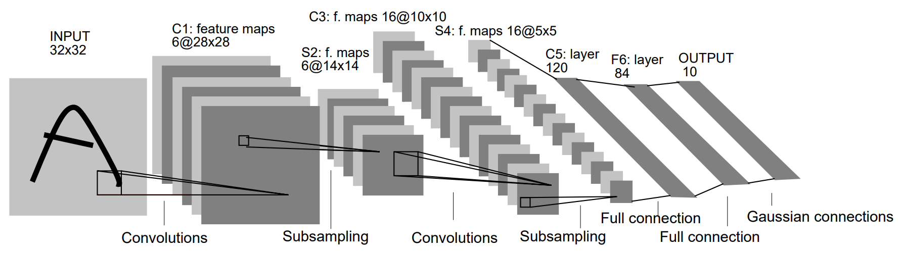
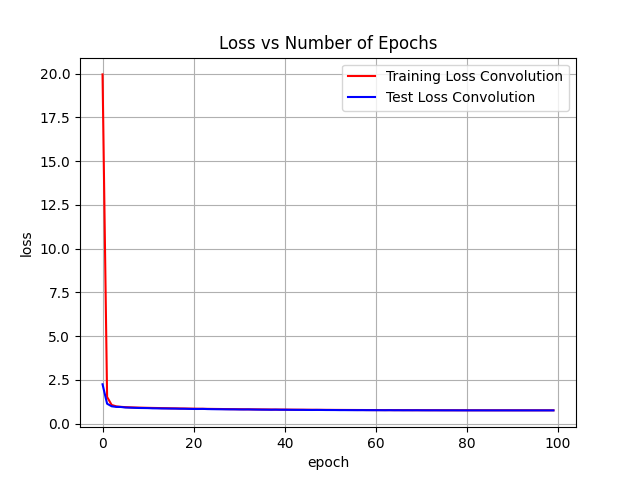
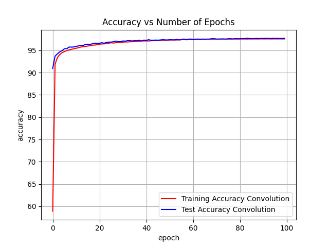
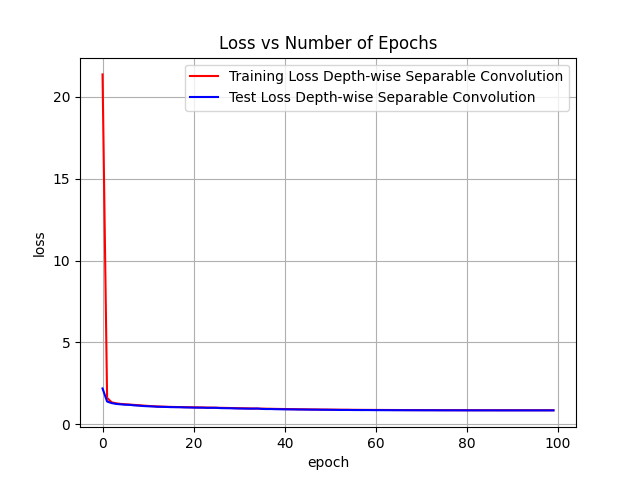
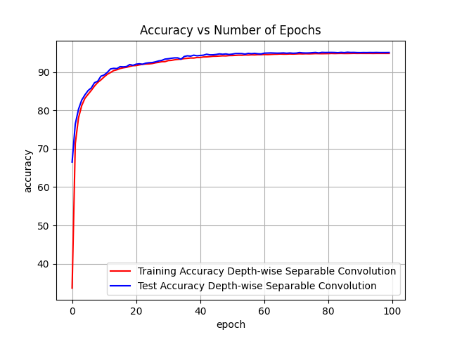

# LeNet-5 : PyTorch Implementation

This is a PyTorch implementation of the LeNet-5 model introduced in "[Gradient Based Learning Applied to Document
Recognition](http://vision.stanford.edu/cs598_spring07/papers/Lecun98.pdf)" (Y. Lecun, L. Bottou, Y. Bengio and P. Haffner, 1998).

### Comment

The papers implementation is very different from the modern implementations of Convolution Neural Networks, namely for Pooling layers, Non-linearity function, Output Layer and Loss function. This is my implementation of the paper that follows the papers implementation as closely as possible using PyTorch, trained on the MNIST Dataset.

## Architecture



## Implementation

1. Subsampling Layer:
   As per paper, Subsampling Layer with kernel size k and stride k, first does the Sum Pooling and then multiplies the result with a trainable coefficient and then adds a trainable bias.
   ```python
    class Subsampling(nn.Module):
        def __init__(self, input_channels, kernel_size=(2, 2), stride=(2, 2)):
            super(Subsampling, self).__init__()
            self.kernel_size = kernel_size
            self.stride = stride
            self.avg_pool = nn.AvgPool2d(self.kernel_size, self.stride)
            self.multiply_coefficient_add_bias = nn.Conv2d(
                in_channels=input_channels,
                out_channels=input_channels,
                kernel_size=1,
                stride=1,
                padding=0,
                groups=input_channels,
                bias=True,
            )
            self.sigmoid = nn.Sigmoid()
    
        def forward(self, x):
            x = self.avg_pool(x)
            x = self.kernel_size[0] * self.kernel_size[1] * x
            x = self.multiply_coefficient_add_bias(x)
            x = self.sigmoid(x)
            return x
    ```

2. Scaled Hyperbolic Tangent Layer:
   The paper uses $f(x) = Atanh(Sx), S = \frac{2}{3}, A = 1.7159$ as the non-linearity/activation function.
   ```python
   class ScaledHyperbolicTangent(nn.Module):
    def __init__(self, S=2/3, A=1.7159):
        super(ScaledHyperbolicTangent, self).__init__()
        self.S = S
        self.A = A
        self.tanh = nn.Tanh()

    def forward(self, x):
        x = self.S * x
        x = self.tanh(x)
        x = self.A * x
        return x
   ```

3. Euclidean Radial Basis Function Layer:
   The paper doesn't use the usual linear layer as the output layer, instead it defines a custom layer. Assume the previous layer's output for a given input image is $x \in R^d$ and we have n classes, then the layer has n vectors $k \in R^d$ as parameters initialized to $\pm1$ randomly. The output of this layer is the euclidean distance of the input x and the n vectors. The models prediction for an image is class i if the euclidean distance corresponding to vector i is the least among all the distances.
   ```python
   class EuclideanRadialBasisFunction(nn.Module):
    def __init__(self, in_features, out_features):
        super().__init__()
        self.in_features = in_features
        self.out_features = out_features
        
        # Initialize centers (-1 or 1 values)
        self.centers = nn.Parameter(
            2 * torch.randint(0, 2, (out_features, in_features), dtype=torch.float32) - 1
        )
        
    def forward(self, x):
        x_expanded = x.unsqueeze(1)
        centers_expanded = self.centers.unsqueeze(0)
        squared_distances = torch.sum((x_expanded - centers_expanded) ** 2, dim=-1)
        return squared_distances
   ```

4. Loss Function:
   The paper doesn't use the usual Categorical Cross Entropy as the loss function, instead it defines a custom loss function. The loss function is given by $E(W) = \frac{1}{P} \sum_{p=1}^{P} \Bigl(y_{D^p}\bigl(Z^p, W\bigr) + \log\bigl(e^{-j} + \sum_{i} e^{-y_i(Z^p, W)}\bigr)\Bigr)$. Minimizing this loss makes the output vector from previous layer to lie close to the parameter vector corresponding to the correct class and far away from the parameter vectors corresponding to the incorrect classes.
   ```python
   class Criterion(nn.Module):
    def __init__(self, j=0.3):
        super(Criterion, self).__init__()
        self.j = torch.tensor(j, dtype=torch.float32)

    def forward(self, distances, ground_truths):
        # distances has shape B x classes, ground_truth has shape B x 1
        if len(ground_truths.shape) == 1:
            ground_truths = ground_truths.unsqueeze(1)

        true_y_terms = distances[torch.arange(ground_truths.shape[0]), ground_truths.squeeze(1)]
        sum_exp_neg = torch.sum(torch.exp(-1 * distances), dim=1)
        log_term = torch.log(torch.exp(-1 * self.j) + sum_exp_neg)
        loss = torch.mean(true_y_terms + log_term)

        return loss
   ```

## Training Mterics

1. (Vanilla) Convolution Layers:
   <p style="float: left;">
      
      
   </p>

2. Depth-wise Separable Convolution Layers:
   I have also trained a second model, where I have replaced the Vanilla Convolution Layer is replaced by Depth-wise Separable Convolution Layer keeping all other things the same.
   <p style="float: left;">
      
      
   </p>
  
